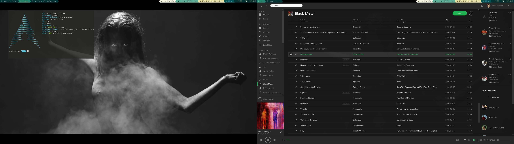

# timur-i3-env
Refactored from my [i3-config](https://github.com/TimurKiyivinski/i3-config-desktop) to use a Powerline status bar instead.
It is a highly opiniated setup for my needs using my themes and liking.

Requires:
* [twmn](https://github.com/sboli/Twmn)
* [feh](https://github.com/derf/feh)
* [maim](https://github.com/naelstrof/maim)
* [playerctl](https://github.com/acrisci/playerctl)
* [imagemagick](https://github.com/ImageMagick/ImageMagick)
* [compton](https://github.com/chjj/compton)
* [rofi](https://davedavenport.github.io/rofi/)
* [powerline](https://github.com/powerline/powerline)
* i3lock, i3-nagbar, URXVT

# setup
Copy `.Xresources` and `.config` to `~/`. You may have to modify the i3 screen setup as this is configured for dual monitors.

# wallpaper setup
Wallpapers are selected on random from `~/.theme/wallpaper-*.png`. Example:
* wallpaper-0.png
* wallpaper-1.png
* wallpaper-2.png

# status bar setup
Create a file `status.py` as a symbolic link to powerline, eg. `/usr/lib/python3.5/site-packages/powerline/bindings/lemonbar/powerline-lemonbar.py`

# start-up programs
Add a list of programs as so into the `env` file.
```
executables=("nm-applet" "firefox" "spotify" "telegram" "owncloud" "redshift-gtk")
```

# screenshots
Desktop:

